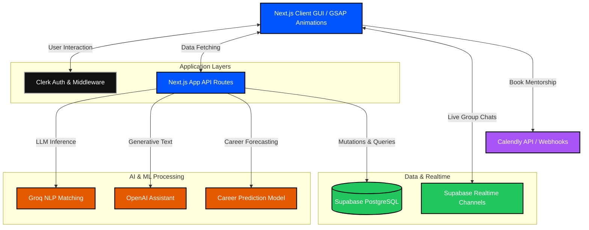

   
  <h1> Virtual Mentor Bridge</h1>
  
<strong>Backing the very best builders — transforming visionary ideas into real-world career growth.</strong>

  
  

    
    
    
  

 

> **The Mentorship Gap:** Millions seek guidance, while thousands of experts want to give back. The current ecosystem is fragmented. Virtual Mentor Bridge unifies them, using intelligent AI algorithms to link ambition with wisdom.

---

##  Features : 

-  **AI-Powered Matching Engine:** An advanced algorithmic system powered by Groq & OpenAI designed to map mentee goals with a mentor's exact expertise.
-  **Machine Learning Career Prediction:** Built-in Python models deployed on Railway to forecast career trajectories based on user assessments.
-  **Real-time Group Chat:** Instant messaging channels implemented for cohorts and direct mentor-mentee interaction using Supabase Realtime.
-  **Calendly Integration:** Frictionless scheduling and booking directly within the platform.
-  **Brutalist UI & Fluid Animations:** A premium, modern web experience leveraging GSAP with liquid metaball effects, brutalist borders, and ScrollTrigger parallax features.
-  **Robust Authentication:** Secure ecosystem powered by Clerk, ensuring mentee and mentor portals remain isolated and secure.
  ## # Soon to be added :
-  **Resume Analyser**
-   **Ai Driven Mentor**
-  **90 Day Roadmap Challenge**

---

## System Architecture

The architecture seamlessly blends serverless endpoints with AI integration:

Some Screen-Shots:

